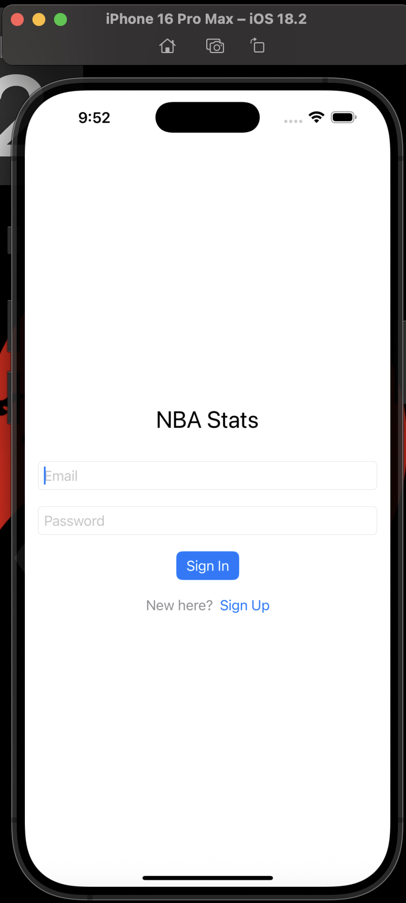
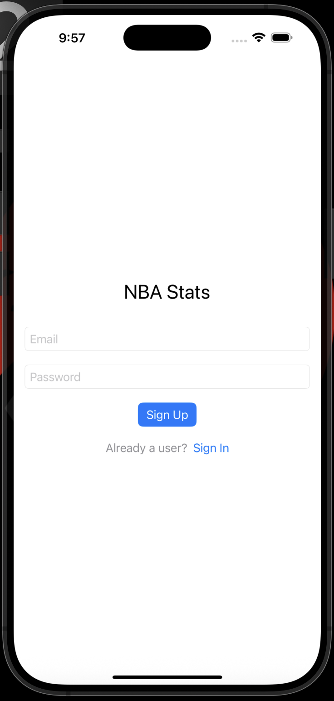
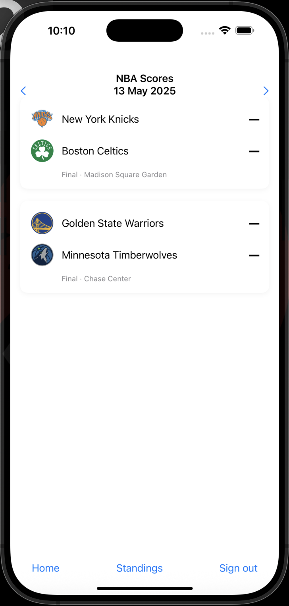
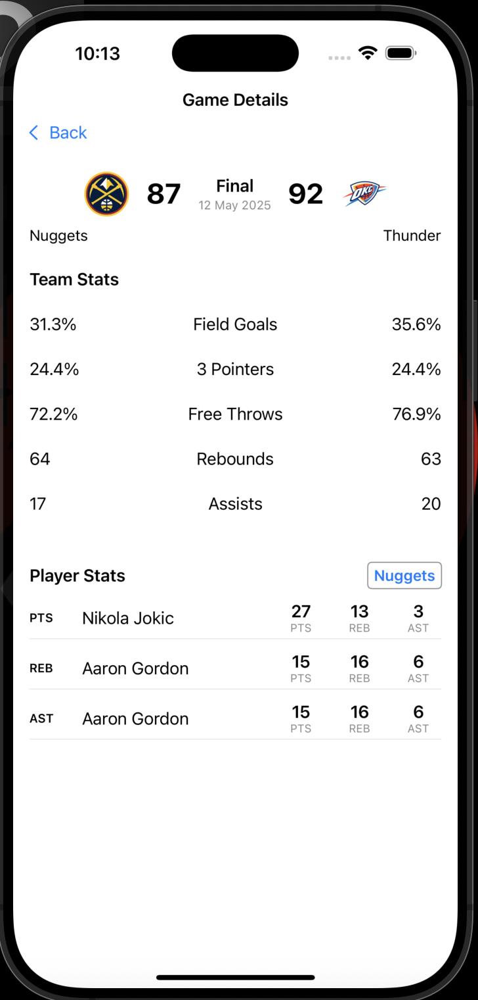
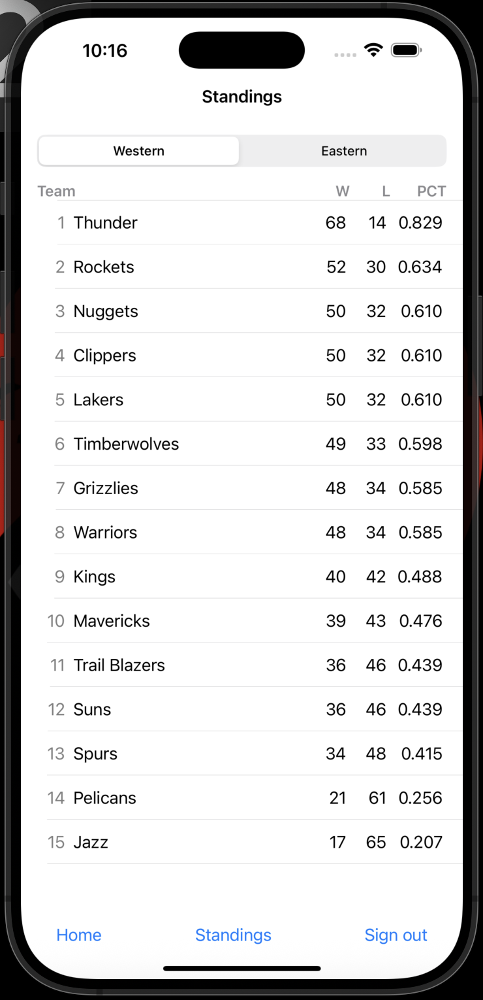

# IOS_Advanced_Final

## Content
- [Setup](#setup)
- [User Guide](#user-guide)
- [Features](#features)

## Setup
1. Clone repository
```git clone https://github.com/AdlbkA/IOS_Advanced_2025.git```
2. Open project in XCode
3. Wait untill project build and run.

# User Guide
1. When you open application, first you will see login screen (Developed using Firebase). If you don't have an account (which you obviously don't have), you can tap "Sign Up" button which will navigate you to the registration screen. <br>
Sign In:

Sign Up:


2. Next you will see main screen with games that will be played on the next day. You can navigate through dates by tapping on the arrows, games will be shown according to the date.


3. If you tap on the game (I took Nuggets vs OKC game from 12 May 2025) You wil see the names, logos of teams, final score and team stats. On the bottom you can see Player stats, I decided just to show player's name and stats that leading in certain category. Then there is a selection bar which you can tap and select the team whoose stat will be present.

4. When you click on the "Standings" NBA team standings will be shown according to conference.


# Features
1. Authentication via Firebase
2. Navigation by dates
3. Game details with selection by teams
4. Standings for each conference